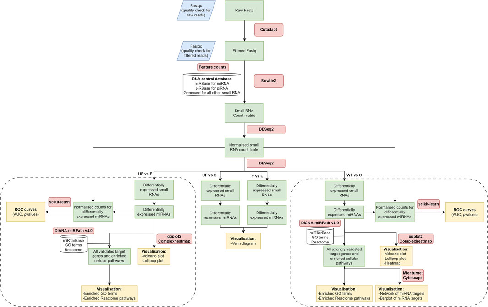

# Small RNA Analysis Pipeline

This repository provides a workflow for analyzing small RNA sequencing data, covering quality control, sequence alignment, differential expression analysis, and functional enrichment of miRNAs and piRNAs.

## Table of Contents
- [Overview](#overview)
- [Workflow Diagrams](#workflow-diagrams)
  - [General Pipeline for Small RNA Analysis](#general-pipeline-for-small-rna-analysis)
  - [Expanded Analysis for piRNAs](#expanded-analysis-for-pirnas)
- [Requirements](#requirements)
- [Usage](#usage)
- [License](#license)

## Overview

The workflow is divided into multiple stages, starting from raw data processing and progressing to differential expression analysis and functional enrichment for both miRNAs and piRNAs. The methodology is visualized in the workflow diagrams below.

## Workflow Diagrams

### General Pipeline for Small RNA Analysis



This diagram illustrates the overall process for small RNA sequencing analysis, including:
1. **Raw Data Processing**: Quality control using FastQC and adapter trimming using Cutadapt.
2. **Read Alignment**: Mapping to reference databases using Bowtie2.
3. **Count Matrix Generation**: Feature counting and normalization using DESeq2.
4. **Differential Expression Analysis**: Identifying differentially expressed small RNAs across comparisons.
5. **Enrichment and Visualization**:
   - ROC curve generation using Scikit-Learn.
   - Functional enrichment via DIANA-miRPath for miRNA.
   - Visualization using ggplot2 for heatmaps, volcano plots, and more.

### Expanded Analysis for piRNAs


This diagram details the piRNA-specific analysis pipeline, which includes:
1. **Target Prediction**: Using MiRanda to predict piRNA target genes.
2. **Target Validation**: Verification of target genes from the piRNA DB and Tarpid.
3. **Functional Enrichment Analysis**: Using EnrichR to identify enriched GO terms and Reactome pathways.
4. **Statistical Analysis**: Comparing groups (e.g., WT vs C) to identify significant differences using Scikit-Learn.
5. **Comprehensive Visualization**: Includes lollipop plots, heatmaps, and sequence analysis of piRNAs.

## Requirements

To run this pipeline, the following software and libraries are required:
- **FastQC**: Quality check for RNA reads.
- **Cutadapt**: Adapter trimming.
- **Bowtie2**: Sequence alignment.
- **DESeq2**: Differential expression analysis.
- **Scikit-Learn**: Machine learning for ROC curve generation.
- **DIANA-miRPath v4.0**: Functional enrichment for miRNAs.
- **EnrichR**: GO term and pathway enrichment.
- **ggplot2**: Visualization for various plots.

## Usage

1. Clone this repository and navigate to the project directory.
   ```bash
   git clone https://github.com/you27-mohamed/Small-RNAseq-analysis.git
   cd small-rna-analysis
